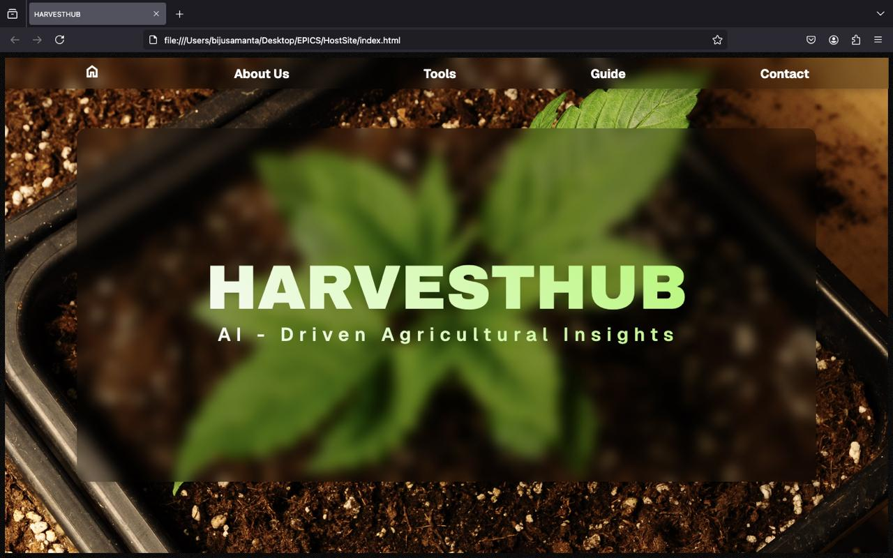
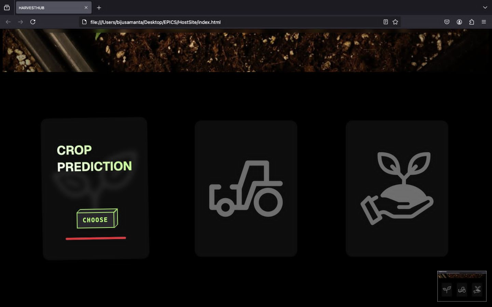
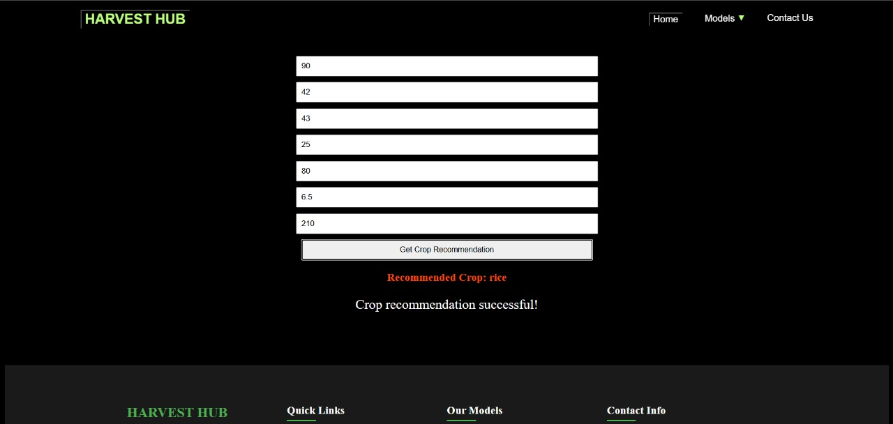
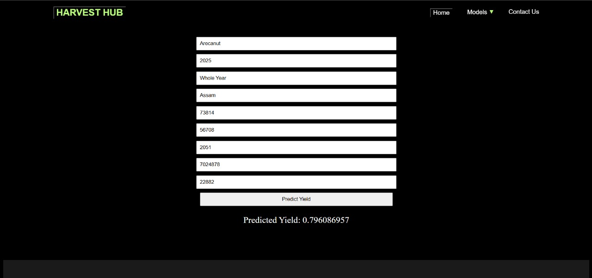
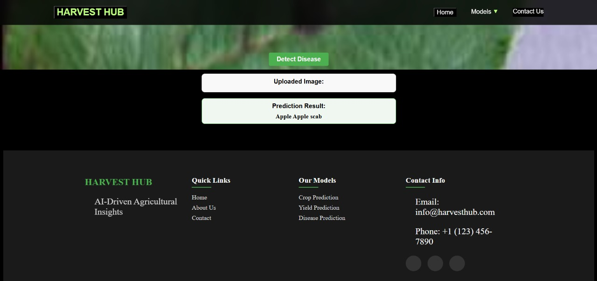

# 🌾 Harvest Hub – AI-Driven Agricultural Insights

**Harvest Hub** is a full-stack AI-powered web platform designed to help farmers make informed, data-driven agricultural decisions. By combining machine learning and computer vision techniques, the platform delivers real-time insights for:

* ✅ **Crop Recommendation**
* 📈 **Crop Yield Prediction**
* 🍂 **Plant Disease Detection**
  Live demo link : https://frontend-ankits-projects-4916b64e.vercel.app/

---

## 🚀 Key Features

### 🌱 Crop Recommendation

Recommends the most suitable crop based on environmental and soil parameters such as NPK levels, pH, temperature, humidity, and rainfall.
→ **Model**: Random Forest Classifier
→ **Accuracy**: \~96%

### 📊 Yield Prediction

Estimates the expected yield for a selected crop using historical and environmental data.
→ **Model**: Decision Tree Regression
→ **Accuracy**: \~85%

### 🩺 Plant Disease Detection

Detects plant diseases from leaf images using a Transformer-based deep learning model.
→ **Model**: Vision Transformer (ViT)
→ **Training Data**: 87,000+ images
→ **Accuracy**: \~92%

---

## 🧰 Tech Stack

| Layer               | Tools / Frameworks                |
| ------------------- | --------------------------------- |
| **Frontend**        | React.js                          |
| **Backend**         | Flask (Python)                    |
| **ML Models**       | Random Forest, Decision Tree, ViT |
| **Computer Vision** | OpenCV                            |
| **Deployment**      | AWS Elastic Beanstalk, EC2, S3    |

---

## ☁️ Cloud Infrastructure

* **AWS Elastic Beanstalk**: Hosting Flask APIs for crop recommendation and yield prediction
* **AWS EC2**: Hosting the plant disease detection model for real-time inference
* **AWS S3**: Storage for trained models and static assets

---

## 📁 Project Structure

```
harvest-hub/
├── frontend/          # React-based user interface
├── backend/           # Flask APIs and integrated ML models
├── disease-model/     # Vision Transformer model for disease detection
├── datasets/          # Training and testing data
├── utils/             # Helper scripts and preprocessing
└── README.md
```

---

## 💡 Motivation

With agriculture being the backbone of many economies, **Harvest Hub** aims to harness the power of artificial intelligence and cloud computing to assist farmers in making smarter choices. Our goal is to build tools that are:

* Accurate
* Scalable
* Easy to use
* Impactful in real-world agricultural scenarios

This project was developed as part of an academic initiative to explore how AI can address practical challenges in farming and food production.

---

## 📸 Demo / Screenshots

<table>
  <tr>
    <td align="center">
      <strong>🏠 Home Page (Initial View)</strong><br/>
      
    </td>
    <td align="center">
      <strong>🏠 Home Page (Alternate View)</strong><br/>
      
    </td>
  </tr>
  <tr>
    <td align="center">
      <strong>🌱 Crop Recommendation Result</strong><br/>
      
    </td>
    <td align="center">
      <strong>📈 Crop Yield Prediction</strong><br/>
      
    </td>
  </tr>
  <tr>
    <td align="center" colspan="2">
      <strong>🍂 Plant Disease Detection</strong><br/>
      
    </td>
  </tr>
</table>

---

## 🤝 Contributions & Feedback

We welcome feedback, suggestions, and collaborations! Feel free to open issues or contribute through pull requests.

---

